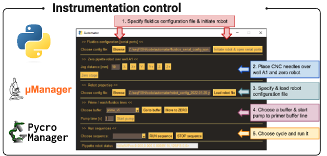
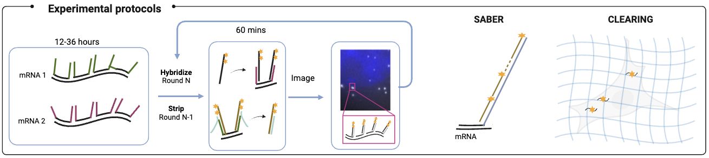
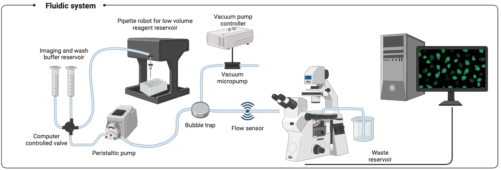

# autoFISH - automated FISH experiments

Python library to control an automated fluidics system and perform acquisition on a microscope for sequential FISH experiments.

**TESTED FOR WIN 10 only**: micromanager and most microscope controls work only under Windows.

## Protocols for smFISH experiments

We provide detailed protocols for single molecule FISH adapated to autoFISH [**here**](https://drive.google.com/drive/folders/1m4SFZFpOHzQbgO7dFY38xFbccV2XqMKH?usp=sharing).

## Documentation

We provide details documentation for the fluidics system and the experimental workflows with the links below:

### Fluidics system and software usage

- Documentation of this **package**: 
  [**PDF**](https://drive.google.com/open?id=1-Fr_Dbg0eQDSbhBmq2gmJ1FDb4Uy_ToI&usp=drive_fs) or 
  [**WORD**](https://docs.google.com/document/d/1-IA6f02elFrF7JSLvXx199cNjnm8ciBB?rtpof=true&usp=drive_fs)

- Documentation to **build the fluidics system**:
  [**PDF**](https://drive.google.com/open?id=1-3anf7ieKRPeKJ387K1XaBH0heWWIocm&usp=drive_fs) or 
  [**WORD**](https://docs.google.com/document/d/1-NUsaEacdTHfEi9gJ_SppbXEfD7z9-im?rtpof=true&usp=drive_fs)

- Documentation to **use a TTL trigger with the LEICA Thunder**:
  [**PDF**](https://drive.google.com/open?id=1-bkihEoPfgZdNXIDN6bbxiwU0kXM9xOt&usp=drive_fs) or 
  [**WORD**](https://docs.google.com/document/d/1-ZXZ6kcjAJHre7fJ8rNfXpDT03TYYEI-?rtpof=true&usp=drive_fs)

## Getting started

### Installation

We recommend using a package manager (conda) to maintain a clean Python installation. This nees to be done only once.

1. Download latest version of miniconda from [**here**](https://docs.conda.io/en/latest/miniconda.html).
2. Open Anaconda terminal and create dedicated environment: `conda create --name autofish python=3.10`
3. Activate environment: `conda activate autofish`
4. Pip install **autofish** (as an alternative see development installation below)
   - Base version (without pycromanager) : `pip install autofish`
   - [Optional] Install pycromanager : `pip install pycromanager`

### Starting autofish

1. Open Anaconda terminal and activate environment: `conda activate autofish`
2. Start user interface with command `autofish`

### Upgrading to a new version

1. Open Anaconda terminal and activate environment: `conda activate autofish`
2. Upgrade autoFISH `pip install --upgrade autofish`

### Development installation

If you want to modify develop the package, several options exist. 

1. Recommended is to **`clone` the repository**. This will then also allow to propose your changes to the main autoFISH repository as a PullRequest. See for instance [here](https://codex.so/fork-and-pull-en) for an explanation for how this is done. This also allows to easier add changes from the main repository 
2. An alternative is a **local installation**. While this might be easier in the short run, it will be challenig to integrate future changes on the main repository. Rather than performing the pip install (step 4 above), you 

   1. Download the zip archive of the branch you are interested in.
   2. Unzip on your machine.
   3. Open Anaconda terminal at location of the autofish package.
   4. Activate environment: `conda activate autofish`
   5. Editable install `pip install . -e`

### Configuration files

The behavior of the fluidics and acquistion system is defined by several config files.

- To test the installation of autofish, you can use demo configurations which require neither a microscope nor a fluidics systems: <https://github.com/fish-quant/autofish/tree/main/demo>

- We provide config files that we use on our system (with a Nikon Ti): <https://github.com/fish-quant/autofish/tree/main/configs>

## Pycromanager

One of the acquisition options is by using Pycromanager. We found that keeping both micromanager and Pycromanager up-to-date can help to prevent problems.

**Last tested, compatible versions**:

- Pycromanager: 0.27.2
- Micromanager: nightly 20230224

## Reporting a problem/suggestion

If you encounter a problem or you have a suggestion, please file an [**issue**](https://github.com/fish-quant/autofish/issues).
