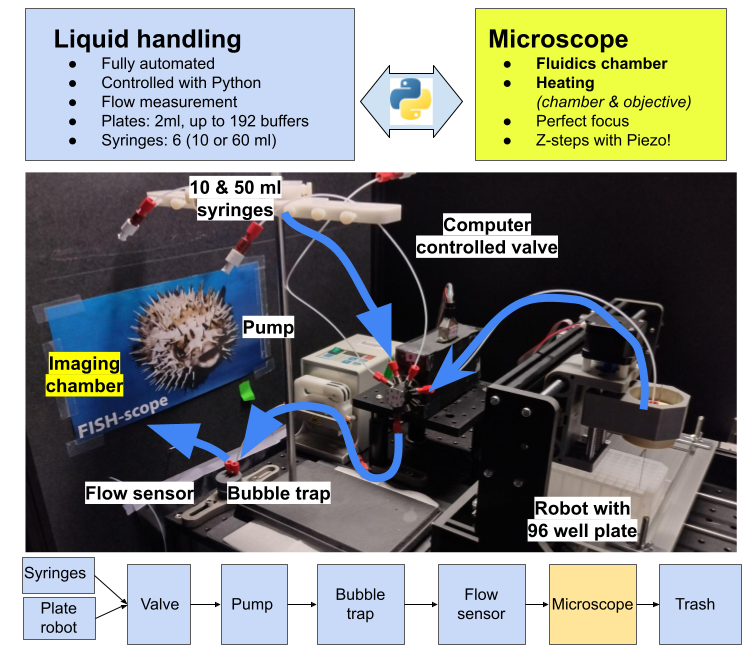

# autoFISH - automated FISH experiments

Python library to control an automated fluidics system and perform microscope acquisition for iterative FISH experiments.

See dedicated documentation [**here**](https://github.com/fish-quant/autofish/blob/master/docs/autofish_manual.pdf) for how to install and use this package.

**TESTED FOR WIN 10 only**: micromanager and most microscope controls work only under Windows.

## Getting started

### Installation

We recommend using a package manager (conda) to maintain a clean Python installation. This nees to be done only once.

1. Download latest version of miniconda from [**here**](https://docs.conda.io/en/latest/miniconda.html).
2. Open Anaconda terminal and create dedicated environment: `conda create --name autofish python=3.9`
3. Activate environment: `conda activate autofish`
4. Pip install autofish
   - Base version (without pycromanager) : `pip install -i https://test.pypi.org/simple/autofish`
   - Install pycromanager : `pip install pycromanager` 

#### Installation for development

If you want to further develop the package, several options exist. A simply one is local installation.

Rather than performing the pip install from pypi (step 4 above), you can install it locally

1. Download the zip archive locally of the repository
2. Open Anaconda terminal at location of the autofish package.
3. Activate environment: `conda activate autofish`
4. Editable install `pip install . -e`

### Pycromanager

One of the acquisition options is via Pycromanager. We found that keeping both micromanager and Pycromanager up-to-date can help to prevent problems.

**Last tested, compatible versions**:

- Pycromanager: 0.27.2
- Micromanager: nightly 20230224

### Starting autofish

1. Open Anaconda terminal and activate environment: `conda activate autofish`
2. Start user interface with command `autofish`

### Configuration files

The behavior of the fluidics and acquistion system is defined by several config files.

- To test the installation of autofish, you can use demo configurations which require neither a microscope nor a fluidics systems: <https://github.com/fish-quant/autofish/tree/main/demo>

- We provide config files that we use on our system (with a Nikon Ti): <https://github.com/fish-quant/autofish/tree/main/configs>

### Building the Fluidics system

See dedicated documentation [**here**](https://github.com/fish-quant/autofish/blob/master/docs/fluidics_construction.pdf) for how to build the fluidics system.

## Reporting a problem/suggestion

If you encounter a problem or you have a suggestion, please file an [**issue**](https://github.com/fish-quant/autofish/issues).
